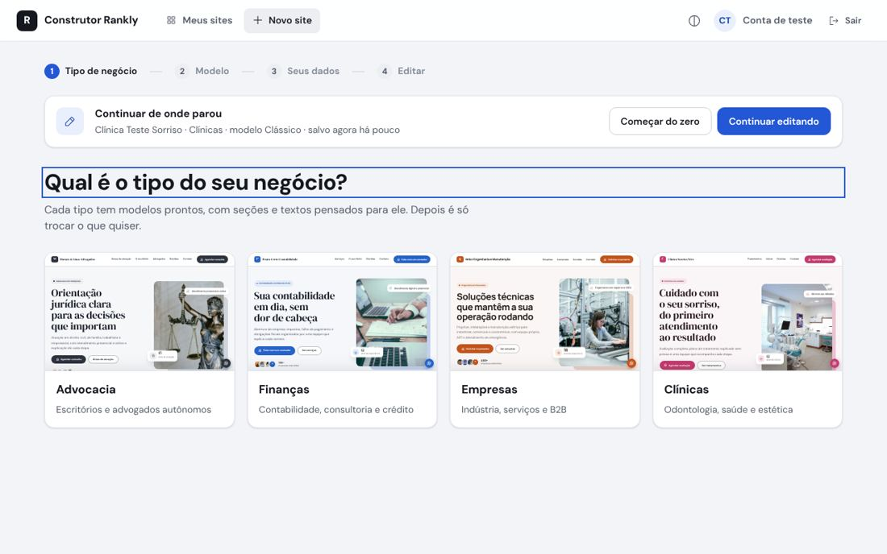
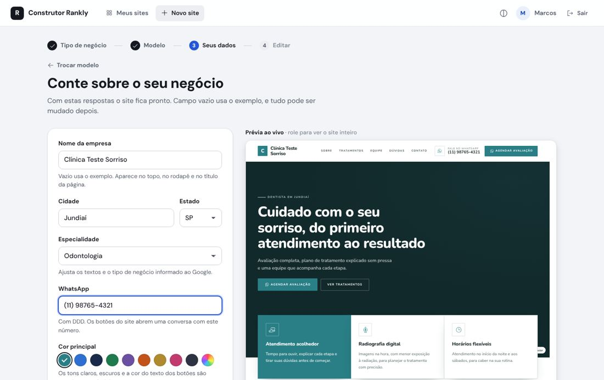
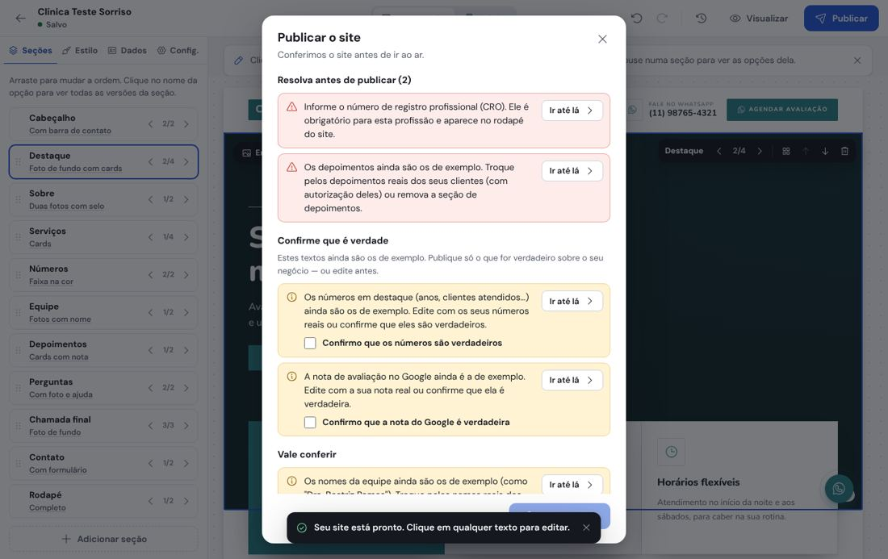
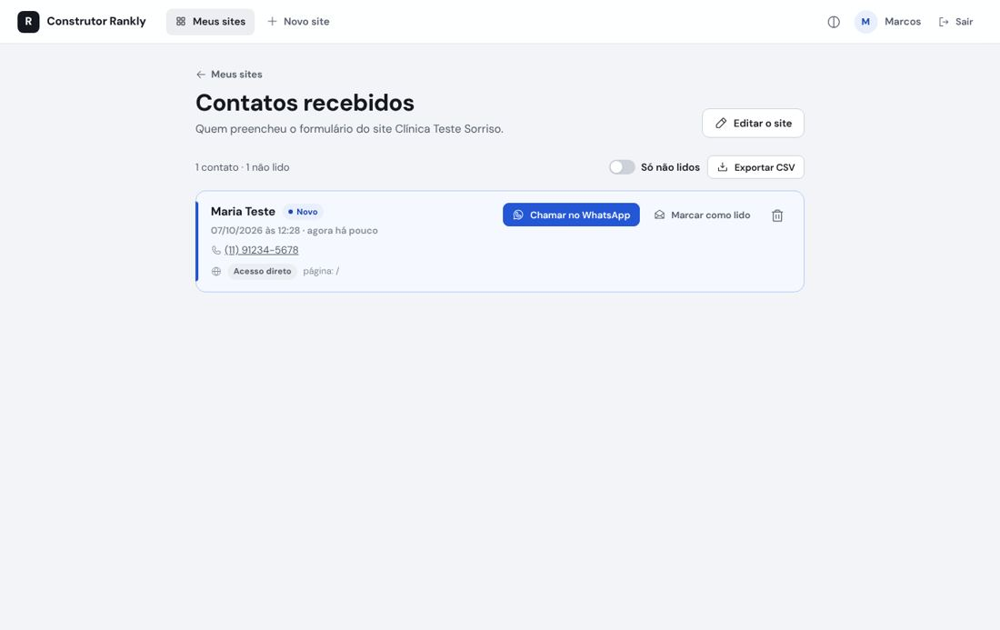

# Como testar o Construtor Rankly no seu computador

Roteiro para ver o sistema funcionando de ponta a ponta: criar um site pelo assistente, editar,
publicar, abrir o site e receber um contato. Leva uns 15 minutos na primeira vez.

> **Só quer abrir e testar, ou mandar para outra pessoa testar?** Use o modo demonstração
> ([`DEMONSTRACAO.md`](DEMONSTRACAO.md)): um clique no GitHub Codespaces ou `docker compose up`.

Este roteiro usa **SQLite** (um arquivo no lugar do banco), então não precisa instalar MySQL.
Em produção, use MySQL/MariaDB (veja o README).

---

## 1. Instalar o que precisa (uma vez só)

Você precisa de **PHP 8.2+** (com as extensões gd, mbstring e sqlite), **Composer** e **Git**.
Node.js só é necessário para os testes automáticos (parte 5).

**macOS** (com [Homebrew](https://brew.sh)):

```bash
brew install php composer git node
```

**Ubuntu / Debian**:

```bash
sudo apt update
sudo apt install -y git unzip php-cli php-gd php-mbstring php-sqlite3 php-xml php-curl php-zip composer
```

**Windows**: use o **WSL** (Ubuntu dentro do Windows). No PowerShell como administrador rode
`wsl --install`, reinicie, abra o "Ubuntu" e siga os comandos de Ubuntu acima. O sistema usa links
simbólicos e scripts bash, que não funcionam bem no Windows puro.

Confira se o PHP gera WebP (deve aparecer `bool(true)`):

```bash
php -r 'var_dump(function_exists("imagewebp"));'
```

---

## 2. Baixar o projeto e configurar

```bash
git clone https://github.com/ury1996/jogo.git construtor-rankly
cd construtor-rankly
git checkout claude/jolly-hawking-m0fur7
composer install
cp config/config.exemplo.php config/config.php
mkdir -p var
```

Abra `config/config.php` num editor de texto e troque as duas linhas do banco:

```php
'driver' => 'mysql',
'dsn' => 'mysql:host=127.0.0.1;port=3306;dbname=rankly;charset=utf8mb4',
```

por:

```php
'driver' => 'sqlite',
'dsn' => 'sqlite:' . __DIR__ . '/../var/rankly.sqlite',
```

Crie as tabelas e o seu usuário (a senha precisa ter 8 caracteres ou mais):

```bash
php app/cli/migrar.php
php app/cli/criar-usuario.php --nome="Marcos" --email=marcos@teste.com --papel=admin --senha=senha12345
```

---

## 3. Ligar o sistema

```bash
bin/dev.sh
```

Deixe esse terminal aberto (Ctrl+C desliga). Ele sobe duas coisas:

- o **editor** em <http://localhost:8080/editor/>
- os **sites publicados** em `http://{nome-do-site}.localhost:8081/`

Use **Chrome ou Firefox** (o Safari não abre endereços `*.localhost`).

## 3.1 Ligar a IA (Gemini, grátis)

A IA escreve os textos e o SEO do site a partir de uma descrição do negócio. Sem chave, o sistema
funciona igual, só sem os botões de IA.

1. Entre em <https://aistudio.google.com/apikey> com uma conta Google e clique em
   **Create API key** (Criar chave de API). Copie a chave.
2. Em `config/config.php`, preencha a chave dentro de `'ia'`:

   ```php
   'ia' => [
       'provedor' => 'gemini',
       'chave' => 'COLE-A-CHAVE-AQUI',
       'modelo' => 'gemini-2.5-flash',
       'modelo_reserva' => 'gemini-2.5-flash-lite',
       'tempo_limite' => 90,
       'limite_por_hora' => 30,
   ],
   ```

   Se o seu `config.php` foi copiado antes desta versão e não tem o bloco `'ia'`, copie-o do
   `config/config.exemplo.php`. Outra opção é deixar a chave fora do arquivo, numa variável de
   ambiente: `GEMINI_API_KEY=sua-chave bin/dev.sh`.
3. Reinicie o `bin/dev.sh` (Ctrl+C e rode de novo).

Para testar sem chave nenhuma, use `'provedor' => 'simulado'`: aparecem textos marcados
"[IA simulada]", só para ver o fluxo funcionando.

Cuidados com o plano gratuito: tem limite de pedidos por minuto e por dia (quando estoura, o
sistema tenta o modelo reserva e, se ainda assim falhar, avisa para tentar de novo em alguns
minutos), e o Google pode usar o conteúdo enviado para melhorar os produtos dele. O sistema só
envia dados do negócio (nome, cidade, ramo e a descrição), nunca dados de clientes ou leads.

## 3.2 Ligar o banco de imagens (Pexels, grátis)

No editor, ao clicar numa foto, a opção **Buscar no banco de imagens** abre a **Biblioteca de
imagens**: você pesquisa (ex.: "consultório odontológico"), clica na foto e ela é baixada para dentro
do sistema e já entra no site, com o crédito do fotógrafo guardado.

1. Crie uma conta grátis em <https://www.pexels.com/api/> e clique em **Your API Key**. Copie a chave.
2. Em `config/config.php`, dentro de `'pexels'`, preencha `'chave' => 'COLE-A-CHAVE-AQUI'`
   (ou use a variável de ambiente `PEXELS_API_KEY`). Reinicie o `bin/dev.sh`.

Sem a chave, a opção aparece com a explicação de como ligar. As fotos do Pexels podem ser usadas de
graça, inclusive em sites comerciais.

## 3.3 Fotos de exemplo

Todo site novo já nasce com fotos em todos os espaços (fotos de exemplo de cada tipo de negócio,
guardadas em `biblioteca/fotos/`), e as miniaturas do assistente mostram os modelos completos. O
dono troca pelas fotos dele (ou do banco de imagens). Ao publicar, a lista de verificação avisa
quantas fotos ainda são de exemplo — principalmente as da equipe, que devem ser dos profissionais
de verdade. Para trocar a seleção de fotos: edite `ferramentas/fotos-exemplo.json` e rode
`php ferramentas/construir-fotos.php`.

---

## 4. Testar o fluxo completo

### 4.1 Entrar

Abra <http://localhost:8080/editor/> e entre com o e-mail e a senha que você criou.
Aparece o painel **Meus sites**, vazio.

### 4.2 Criar um site pelo assistente

1. Clique em **Novo site**.
2. **Tipo de negócio**: escolha **Clínicas**. As miniaturas são o site de verdade, em tamanho
   reduzido.

   

3. **Modelo**: cada tipo de negócio tem 7 modelos — 4 exclusivos dele (para Clínicas: Acolher,
   Essência, Vital e Agenda) e os 3 gerais (Clássico, Moderno e Direto). Clique em **Ver prévia** em
   qualquer um para ver o site inteiro (dá para alternar Computador/Celular). Depois clique em
   **Usar este modelo** no **Clássico**.
   *(Todos funcionam; o Clássico tem formulário de contato no fim da página, o que facilita o teste
   do item 4.6.)*
4. **Dados**: preencha nome (ex.: "Clínica Teste Sorriso"), cidade, estado e WhatsApp.
   Repare que a prévia à direita muda a cada tecla. Teste também trocar a cor.
   Com a IA ligada, aparece o campo **O que você quer no site?**: escreva algo como
   "Clínica odontológica focada em implantes e ortodontia, atendemos convênios e aos sábados".

   

5. Clique em **Gerar meu site**. Com descrição, a IA leva de 10 a 40 segundos escrevendo os textos.

### 4.3 Editar


Coisas para experimentar:

- **Texto**: clique no título grande e escreva outra coisa. Enter confirma. Os textos em caixa alta
  (botões, rótulos) continuam com a caixa original guardada.
- **Desfazer/refazer**: setas no alto, ou Ctrl+Z / Ctrl+Shift+Z.
- **Foto**: clique num espaço de foto e envie uma imagem do seu computador.
- **Ícone**: clique num ícone de serviço e escolha outro. Ou edite o título do serviço (ex.:
  "Implantes") e veja o ícone mudar sozinho.
- **Seções** (painel da esquerda): as setas ‹ › trocam o visual da seção sem perder o texto; arraste
  para mudar a ordem; **Adicionar seção** no fim da lista.
- **Lista de serviços**: passe o mouse na seção de serviços e use **Adicionar** / **Remover** item.
- **Estilo**: troque cor, acabamento (Clássico, Moderno, Direto, Elegante, Suave, Impacto) e fontes
  (7 pares).
- **Visual das seções**: as setas ‹ › de cada seção mostram as opções (o Destaque, por exemplo, tem 8).
- **Computador / Celular** no alto, e **Visualizar** para ver sem as ferramentas (Esc volta).
- **IA**: **Escrever com IA** na barra do alto reescreve o site inteiro; o ícone de brilho na
  barrinha de cada seção reescreve só aquela seção. **Desfazer** volta ao que estava. A IA não
  escreve números, depoimentos, nota do Google nem nomes da equipe: isso continua para você
  conferir na publicação.

O status embaixo do nome do site mostra **Salvando…** e **Salvo**: o salvamento é automático.

### 4.4 Publicar (a lista de verificação vai barrar, de propósito)

Clique em **Publicar**. A lista de verificação aparece e **bloqueia** a publicação por dois motivos,
como deve fazer:



1. **Falta o registro profissional (CRO)**: clique em **Ir até lá**, preencha o número, a UF e o
   responsável técnico.
2. **Depoimentos de exemplo**: na aba **Seções**, passe o mouse em **Depoimentos** e clique na
   lixeira (ou edite os depoimentos com textos reais).

Clique em **Publicar** de novo. Agora sobram só confirmações (números de exemplo, nota do Google):
marque as caixas **Confirmo…** e clique em **Publicar agora**.

### 4.5 Ver o site publicado

Na janela **Site publicado!**, clique em **Abrir site**. O endereço é algo como
`http://clinicatestesorriso.localhost:8081`.


Confira também:

- o rodapé com o CRO e o link **Política de privacidade** (página gerada automaticamente);
- o site no celular: no Chrome, F12 → ícone de celular;
- um endereço que não existe (ex.: `/teste`) mostra a página 404 do próprio site.

### 4.6 Enviar um contato e ver o lead

1. No site publicado, role até o formulário de contato.
2. **Espere uns 3 segundos** depois de abrir a página (envios mais rápidos que isso são tratados como
   robô e descartados sem aviso) e envie nome e telefone.
3. Volte ao editor → **Meus sites** → no cartão do site, clique em **Contatos**.



O e-mail de aviso ao dono não é enviado de verdade no computador: ele vira um arquivo `.eml` em
`var/emails/` (abre no Outlook, Thunderbird ou num editor de texto). Pode levar até 1 minuto,
porque é o cron do `bin/dev.sh` que envia.

### 4.7 Outras coisas para testar

- **Voltar à publicação anterior**: publique uma segunda vez com uma mudança e use
  **Voltar à publicação anterior** na janela de publicação.
- **Histórico de versões**: ícone de relógio no alto do editor.
- **Duas abas**: abra o mesmo site em duas abas, edite nas duas e veja o aviso de conflito.
- **Sem internet**: desligue a rede, edite, religue; a alteração é enviada sozinha.
- **Esqueci a senha**: na tela de entrar; o link chega como arquivo em `var/emails/`.
- **Tema escuro** do editor: botão ao lado do seu nome.

---

## 5. Testes automáticos (opcional)

Precisa de Node.js 22.

```bash
composer install            # inclui o PHPUnit
npm install
npx playwright install chromium

npm test                                        # testes JS (~190)
vendor/bin/phpunit -c tests/php/phpunit.xml      # testes PHP (~270)
npm run paridade                                 # editor (JS) e servidor (PHP) geram o mesmo HTML
RANKLY_E2E_BANCO=sqlite npm run e2e              # navegador de verdade: fluxo completo e os 12 sites
```

Ou tudo de uma vez: `bin/testar.sh`. O teste ponta a ponta salva capturas dos 28 sites
(4 nichos × 7 modelos, computador e celular) em `var/e2e/capturas/`.

---

## Problemas comuns

| Sintoma | Solução |
|---|---|
| `Dependências ausentes: rode "composer install"` | Rode `composer install` na pasta do projeto. |
| `Não foi possível migrar o banco` | Confira as duas linhas do banco em `config/config.php` e se a pasta `var/` existe. |
| Porta 8080 ou 8081 ocupada | `PORTA_EDITOR=8090 bin/dev.sh` (para os sites, mude também `dominio_sites` no `config.php`). |
| O site publicado não abre | Use Chrome ou Firefox; confira se o `bin/dev.sh` continua rodando. |
| O formulário "envia" mas o contato não aparece | Espere 3 s depois de abrir a página antes de enviar; e não mais de 5 envios por hora do mesmo computador. |
| Fotos não geram | `php -r 'var_dump(function_exists("imagewebp"));'` precisa dar `true` (instale `php-gd`). |
